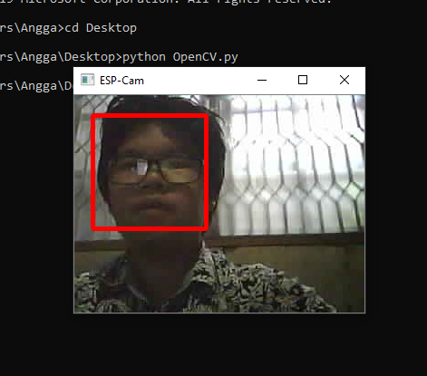

# Final Project IDS
## Oleh
- Anggada Putra Nagamas – 05311840000025

## Judul
**Anti Spoofing Untuk Face Recognition System Menggunakan Thermal Sensor & ESP32-Cam**

## Alat
- Arduino Uno
- ESP32-Cam
- GY-906 MLX90614 (Thermal Sensor)

## Kebutuhan
- Python (Code ini dijalankan dengan python versi 3.7.3).
- Package OpenCV (Install dengan mengetikkan `pip install opencv-python` di terminal atau command prompt).
- Package Urllib.request (Install dengan mengetikkan `pip install urllib.request` id terminal atau command prompt).
- Package numpy (Install dengan mengetikkan `pip install numpy` di terminal atau command prompt).
- Package twilio (Install dengan mengetikkan `pip install twilio` di terimal atau command prompt).
- Package serial (Install dengan mengetikkan `pip install pyserial` di terminal atau command prompt).
- Akun Twilio (Dapat dibuat melalui link berikut: `https://www.twilio.com/try-twilio` melalui browser).

## Pengerjaan
**Langkah 1: Face Recognition**
- Hubungkan Arduino Uno dengan ESP32-Cam seperti gambar berikut:

| Arduino Uno | ESP32-Cam | 
|--|--|
| 5V | 5V | 
| GND | GND | 
| TX | U0T | 
| RX | U0R | 
| RESET - GND | GND - GPIO0 | 

- Download library ESP32-Cam berupa file ZIP untuk program yang akan ditanamkan pada ESP32-Cam dari link berikut: https://github.com/yoursunny/esp32cam.
- Kemudian tambahkan file ZIP yang telah didownload ke library Arduino IDE dengan cara memilih ``Sketch > Include Library > Add .ZIP library...`` lalu pilih file ZIP.
- Buka contoh source dari library yang telah ditambahkan ke dalam Arduino IDE dengan cara memilih ``File > Examples > esp32cam > WifiCam``
- Setting Board Manager dengan cara memilih ``Tools > Board: > ESP32 Arduino > ESP32 Wrover Module``.
- Kemudian setting Board Manager seperti gambar berikut:

- Lalu upload code tersebut ke ESP32-Cam.

**Note**:
- Tekan tombol reset pada ESP32-Cam ketika melakukan proses upload code.
- Lepaskan kabel Ground (GND) dengan GPIO0 pada ESP32-Cam seperti gambar berikut:

- Kemudian tekan tombol reset dan buka serial monitor.
- Sesuaikan alamat url yang ada pada serial monitor dengan file `OpenCV.py`.
- Lalu jalankan program `OpenCV.py` dengan mengetikkan `python OpenCV.py` pada terminal atau command prompt dengan lokasi direktori dimana file program tersebut berada.

**Hasil**

**Langkah 2: Membuat Threshold & Sistem Notifikasi**
- Hubungkan Arduino Uno dengan MLX90614 seperti gambar berikut ini:

| Arduino Uno | MLX90614 | 
|--|--|
| 5V | VCC | 
| GND | GND | 
| A4/SDA | SDA | 
| A5/SCL | SCL | 

- Kemudian tambahkan library `Adafruit_MLX90614` dengan cara memilih ``Sketch > Include Library > Manage Libraries...``.
- Lalu cari MLX90614 pada kolom pencarian dan install library Adafruit_MLX90614 yang tersedia.
- Buka contoh code dengan memilih ``File > Examples > Adafruit MLX90614 Library > mlxtest``.
- Setting Board Manager dengan cara memilih ``Tools > Board: > Arduino AVR Boards > Arduino Uno`` seperti gambar berikut:

- Upload code tersebut ke dalam board manager Arduino Uno.
- Atur pesan pada program `Alerts.py` sesuai dengan akun twilio yang telah dibuat.
- Jalankan program `Alerts.py` dengan mengetikkan `python Alerts.py` pada terminal atau command prompt dengan lokasi direktori dimana file program tersebut berada.

**Hasil**

## Penggabungan Sistem
- Program `OpenCV.py` dan `Alerts.py` dapat digabungkan dengan syarat memiliki dua buah board manager karena penggunaan sensor dengan pin I2C dan ESP32-Cam sulit dilakukan pada satu board manager yang sama jika ESP32-Cam sedang menggunakan modul WiFi. 
